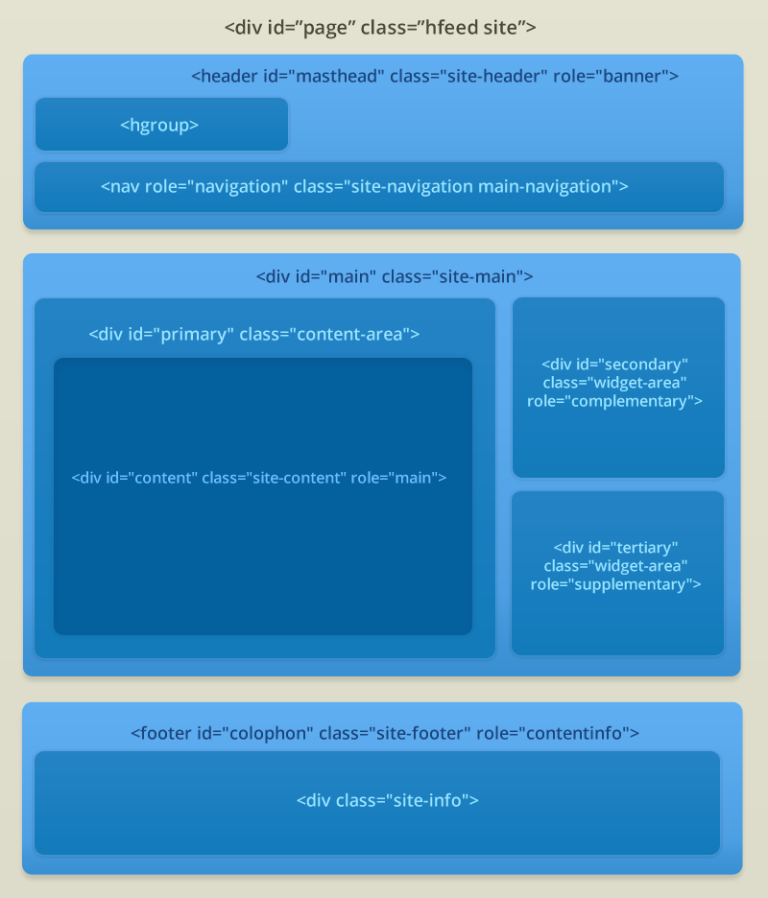

# Exercice 2 - Créer son premier thème

## Objectifs 
Cet exercice a pour objectifs : 
* De créer son premier thème
* De mettre en place la structure de son thème au niveaux des fichiers et des dossiers
* De mettre en place la structure HTML de notre thème

## Présentation

* Nous allons réaliser un thème en nous appuyant sur la maquette suivantes 

* Pour cela  nous allons développer un thème avec les différents éléments de structures de ce thèmes, ainsi que les plugins nécessaire à la mise en place de ce site.

## Création du thème

* Commencer par créer un dossier dans wp-content/themes qui se nomme kovalibre
* Dans ce dossier nous créons les dossiers et fichiers suivants (vide pour l'instant nous allons les remplir petit à petit)
```
|- inc (dossier)
|- js (dossier)
|- languages (dossier)
|- layouts (dossier)
|- 404.php
|- archive.php
|- comments.php
|- content.php
|- content-aside.php
|- content-page.php
|- content-single.php
|- footer.php
|- functions.php
|- header.php
|- index.php
|- no-results.php
|- page.php
|- search.php
|- searchform.php
|- sidebar.php
|- single.php
|- license.txt
|- rtl.css
|- style.css
```
* Nous allons maintenant déclarer les thème au travers d'un commentaire dans le dernier fichier (style.css). Cela se fait au travers de métadonnées déclarées dans un commentaire : 
```css
01
02
03
04
05
06
07
08
09
10
11
12
13
	
/*
Theme Name: Kovalibre
Theme URI: https://www.kovalibre.com/
Author: Vanessakovalsky
Author URI: https://github.com/vanessakovalsky
Description: Theme for demonstration purpose during training about Wordpress.
Version: 1.0
License: GNU General Public License
License URI: license.txt
Tags: light, white, one-column, two-columns, left-sidebar, right-sidebar, flexible-width, custom-backgroud, custom-header, custom-menu, featured-images, flexible-header, microformats, post-formats, rtl-language-support, threaded-comments, translation-ready
This theme, like WordPress, is licensed under the GPL.
Use it to make something cool, have fun, and share what you've learned with others.
*/
```
* Détaillons un peu les différents éléments : 
    * *Theme name* : Le nom du theme
    * *Theme url* : L'url de la page d'accueil de votre theme, par exemple votre site ou une page spécifique de celui-ci
    * *Author* : Votre nom
    * *Author URI* : Lien vers votre site
    * *Description* : Ecrire une description brève et claire de votre thème, en expliquant à quoi il sert et ses fonctionnalités en quelques phrases. Cette description apparait dans le Tableau de bord d'administration, et dans la liste des thèmes sur Wordpress.org (si vous publier votre thème)
    * *Version* : Le numéro de version de votre thème. A vous de décider de la manière dont vous numéroter les versions de votre thème. Pensez à changer le numéro de version lors d'une mise à jour
    * *License* : La licence de votre thème. Si vous distribuez votre thème, il est nécessaire d'utiliser la licence GPL, qui est celle utilisée par WordPress
    * *License URI* : Lien où les utilisateurs peuvent trouver le texte de la licence. 
    * *Tags* : Mot-clé permettant de décrire les fonctionnalités de votre thème, ces couleurs et sujets. Ils sont requis si vous prévoyer de distribuer votre thème pour permettre la recherche sur répertoire des thèmes. 
* Le seul champ obligatoire est le nom du thème, mais il est conseillé de respecter les bonnes pratiques et de remplir les différents champs 
* Vous pouvez maintenant depuis l'interface d'administration retrouver votre thème et l'activer. 

## Structre HTML

* Nous allons maintenant définir la structure HTML de notre site.
* La structure de notre site ressemblera à : 

* Pour cela commençons avec la définition du header dans le fichier *header.php* :
```php
<div id="page" class="hfeed site">
     <header id="masthead" class="site-header" role="banner">
         <hgroup></hgroup>
         <nav role="navigation" class="site-navigation main-navigation"></nav><!-- .site-navigation .main-navigation -->
     </header><!-- #masthead .site-header -->
<div id="main" class="site-main">
```
* Puis nous définissons le footer dans le fichier *footer.php* : 
```php
</div><!-- #main .site-main -->
     <footer id="colophon" class="site-footer" role="contentinfo">
          <div class="site-info"></div><!-- .site-info -->
     </footer><!-- #colophon .site-footer -->
</div><!-- #page .hfeed .site -->
```
* Continuons avec la sidebar dans le fichier *sidebar.php* : 
```php
<div id="secondary" class="widget-area">
</div><!-- #secondary .widget-area -->
 
<div id="tertiary" class="widget-area">
</div><!-- #tertiary .widget-area -->
```
* Enfin nous définissons la page d'index qui contient le contenu principal, dans le fichier *index.php* mettre le contenu suivant :
```php
<div id="primary" class="content-area">
    <div id="content" class="site-content" role="main">
    </div><!-- #content .site-content -->
</div><!-- #primary .content-area -->
```
* Enfin pour lier le tout et avoir un thème fonctionnel rajouter avant tout autre contenu dans le fichier *index.php* la ligne suivante :
```php
<?php get_header(); ?>
```
* Et en bas du même fichier *index.php* : 
```php
<?php get_sidebar(); ?>
<?php get_footer(); ?>
```
* Cela permet à WordPress d'appeler nos autres templates.